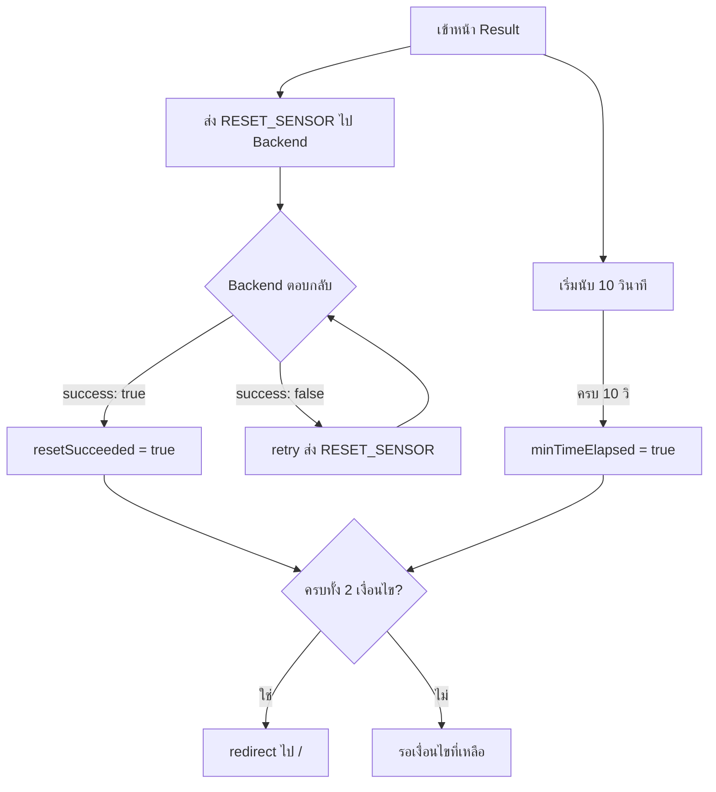

# Reset Condition — Result Page

## Overview

เมื่อผู้ใช้เข้าสู่หน้าแสดงผล (Result Page) ระบบจะ:

1. **แสดงผลลัพธ์** ระดับแอลกอฮอล์ให้ผู้ใช้ดู
2. **ส่งคำสั่ง `RESET_SENSOR`** ไปยัง Backend เพื่อรีเซ็ตเซนเซอร์
3. **รอจนครบเงื่อนไขทั้งสอง** ก่อน redirect กลับหน้าหลัก

---

## Conditions for Redirect

ระบบจะ redirect กลับหน้าหลัก (`/`) เมื่อเงื่อนไข **ทั้งสองข้อ** เป็นจริง:

| # | เงื่อนไข | ตัวแปร | คำอธิบาย |
|---|----------|--------|----------|
| 1 | แสดงผลครบ 10 วินาที | `minTimeElapsed` | ให้ผู้ใช้มีเวลาอ่านผลลัพธ์อย่างน้อย 10 วินาที |
| 2 | Backend รีเซ็ตสำเร็จ | `resetSucceeded` | Backend ตอบ `{ type: "reset_result", success: true }` |

---

## Flow Diagram



---

## Scenarios

### Scenario 1: Reset สำเร็จก่อน 10 วินาที
```
t=0s   → แสดงผล + ส่ง RESET_SENSOR
t=3s   → Backend ตอบ success ✓ (resetSucceeded = true)
t=10s  → ครบ 10 วิ ✓ (minTimeElapsed = true)
t=10s  → ✅ redirect ไปหน้าหลัก
```

### Scenario 2: Reset สำเร็จหลัง 10 วินาที
```
t=0s   → แสดงผล + ส่ง RESET_SENSOR
t=10s  → ครบ 10 วิ ✓ (minTimeElapsed = true)
t=15s  → Backend ตอบ success ✓ (resetSucceeded = true)
t=15s  → ✅ redirect ไปหน้าหลัก
```

### Scenario 3: Reset ล้มเหลว → retry
```
t=0s   → แสดงผล + ส่ง RESET_SENSOR
t=5s   → Backend ตอบ success: false ✗ → retry RESET_SENSOR
t=10s  → ครบ 10 วิ ✓ (minTimeElapsed = true)
t=12s  → Backend ตอบ success ✓ (resetSucceeded = true)
t=12s  → ✅ redirect ไปหน้าหลัก
```

---

## Event Flow (Frontend ↔ Backend)

```
Frontend                          Backend
   │                                 │
   │── RESET_SENSOR ──────────────►  │
   │                                 │  _reset_sensor()
   │                                 │  → reset_sensor_hardware()
   │                                 │
   │  ◄── reset_result ─────────────│  { type: "reset_result", success: true/false }
   │                                 │
   │  (if success=false)             │
   │── RESET_SENSOR (retry) ──────► │
   │                                 │
```

---

## Related Files

| File | Role |
|------|------|
| `src/app/components/ResultPanel.js` | Frontend — แสดงผลและจัดการ redirect logic |
| `src/hooks/useKiosk.js` | Frontend — รับ `reset_result` event จาก WebSocket |
| `src/hooks/useMockKiosk.js` | Frontend — จำลอง reset result สำหรับ dev mode |
| `Backend/services/alcohol_service.py` | Backend — `_reset_sensor()` ส่ง event กลับ |
| `Backend/functions/alcohol.py` | Backend — `reset_sensor_hardware()` hardware reset |
